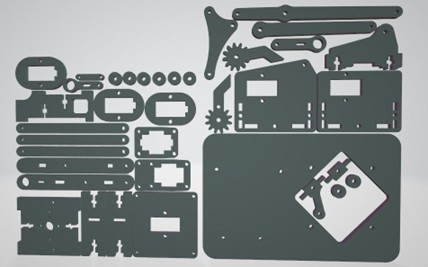
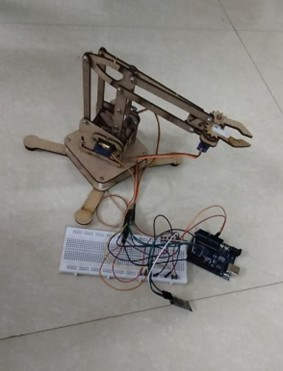

# Wireless Controlled Pick and Place Robotic Arm

## Overview
This project presents a wireless controlled pick-and-place robotic arm manipulator
designed to handle small, lightweight objects. The system uses a 3 Degree of Freedom (DOF)
robotic arm controlled via a Bluetooth module (HC-05), enabling real-time wireless operation.

The project integrates mechanical design, embedded systems, and wireless communication
to provide a compact and cost-effective automation solution.

---

## Key Features
- 3 DOF robotic arm with servo motor actuation
- Wireless control using HC-05 Bluetooth module
- Real-time control through a mobile application
- Lightweight and low-cost mechanical structure
- Suitable for educational and small-scale automation tasks

---

## Design Diagram

---

## Hardware Components
- Arduino Uno (ATmega328P)
- SG90 Servo Motors
- HC-05 Bluetooth Module
- MDF Board (mechanical frame)
- Servo-based Gripper
- External Power Supply (9V)

---

## Software Tools
- Arduino IDE
- Bluetooth Controller Mobile Application
- Embedded C (Arduino)

---

## Working Principle
1. User sends control commands via a Bluetooth-enabled mobile application.
2. HC-05 Bluetooth module receives commands wirelessly.
3. Arduino Uno processes the commands.
4. PWM signals are generated to control servo motors.
5. The robotic arm performs pick, move, and place operations accordingly.

---

## Methodology
- Mechanical frame designed and assembled using MDF board.
- Servo motors mounted at each joint to provide required DOF.
- Bluetooth module interfaced with Arduino using UART.
- Control logic implemented using Arduino IDE.
- System tested and calibrated for smooth motion and accuracy.

---

## Results
- Successful wireless control of robotic arm movements.
- Smooth joint motion and precise gripper operation.
- Reliable pick-and-place performance for lightweight objects.

---

## Applications
- Educational demonstrations
- Robotics learning platforms
- Small-scale automation
- Prototype testing

---

## Limitations
- Limited payload capacity
- Restricted operating range
- No sensor-based feedback system

---

## Future Enhancements
- Add more degrees of freedom
- Integrate sensors for feedback control
- Increase payload capacity
- Implement mobile app with GUI controls

---

## Project Status
Completed

---

## Team Members
- Prem Arun P
- Dhivakar PCK
- Varun G
- Siranjeevi M
- Abishekragul S

---

## References
1. John-David Warren, Josh Adams, Harald Molle, *Arduino Robotics*
2. Autodesk Instructables – *The MeArm: A Pocket-Sized Robotic Arm*
